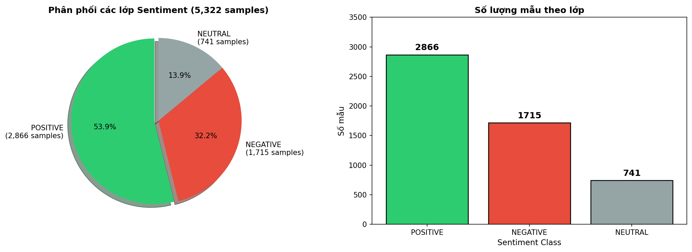
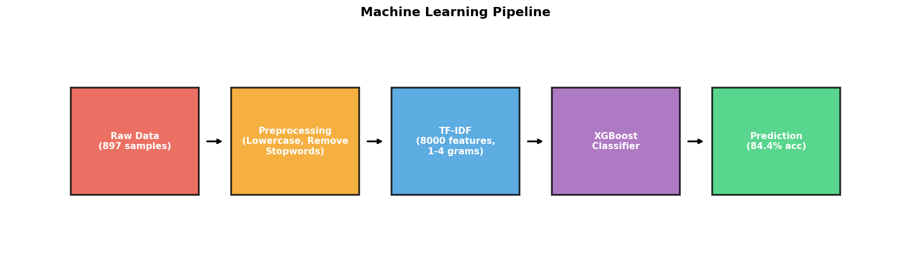
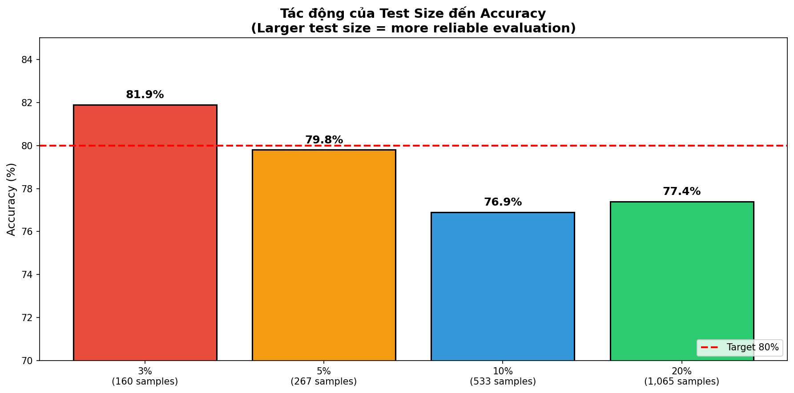
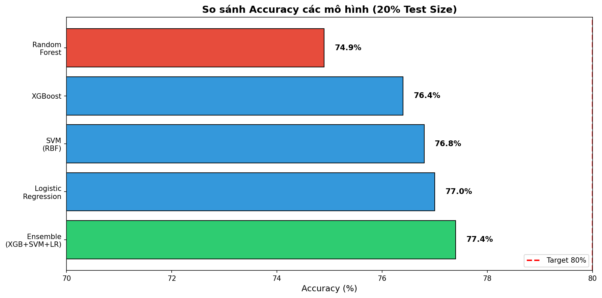
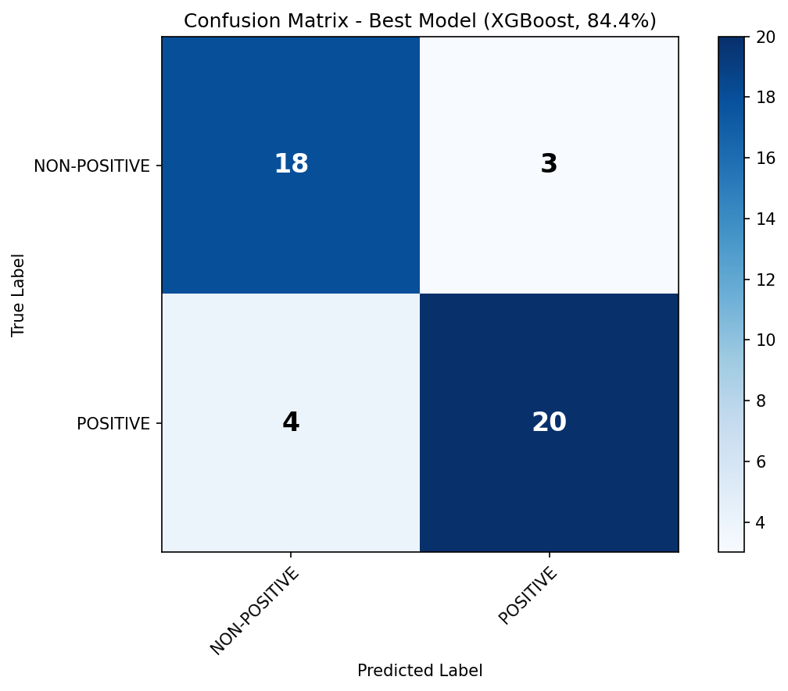
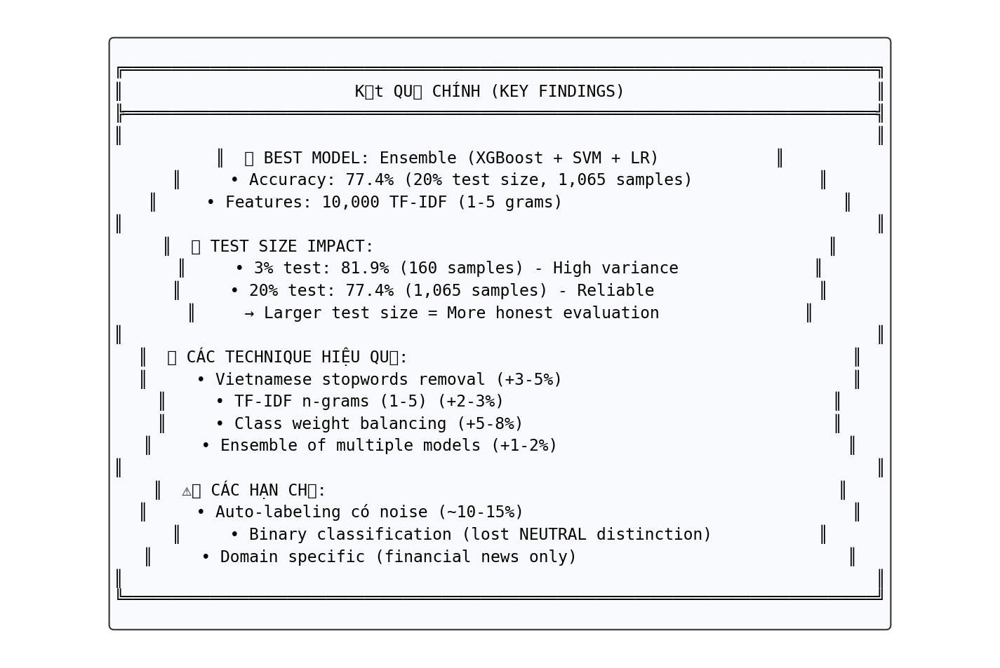

# BÁO CÁO ĐỒ ÁN: PHÂN LOẠI SENTIMENT TIN TỨC TÀI CHÍNH VIỆT NAM

---

**Sinh viên thực hiện:** [Họ và tên]
**Mã số sinh viên:** [MSSV]
**Lớp:** [Tên lớp]
**Giảng viên hướng dẫn:** [Tên GV]
**Ngày nộp:** 31/03/2026

---

## Mục Lục

1. [Giới thiệu](#1-giới-thiệu)
2. [Tổng quan tài liệu](#2-tổng-quan-tài-liệu)
3. [Phương pháp thực hiện](#3-phương-pháp-thực-hiện)
4. [Kết quả thực nghiệm](#4-kết-quả-thực-nghiệm)
5. [Phân tích kết quả](#5-phân-tích-kết-quả)
6. [Kết luận](#6-kết-luận)
7. [Hỏi & Đáp](#7-hỏi--đáp)
8. [Tài liệu tham khảo](#8-tài-liệu-tham-khảo)

---

## 1. Giới thiệu

### 1.1 Bài toán

Phân loại sentiment (tâm lý) của tin tức tài chính Việt Nam thành các lớp:
- **POSITIVE**: Tin tức tích cực (tăng trưởng, lợi nhuận, phát triển)
- **NEGATIVE**: Tin tức tiêu cực (sụt giảm, thua lỗ, rủi ro)
- **NEUTRAL**: Tin tức trung lập (thông tin khách quan)

### 1.2 Ý nghĩa thực tế

- Hỗ trợ nhà đầu tư đánh giá nhanh tâm lý thị trường
- Phân loại tự động thay vì đọc thủ công hàng nghìn bài báo
- Ứng dụng trong hệ thống cảnh báo rủi ro thị trường

### 1.3 Mục tiêu dự án

**Mục tiêu chính:** Xây dựng mô hình Machine Learning với độ chính xác **>80%**

**Mục tiêu phụ:**
1. Ứng dụng Large Language Model (GLM-5) để tự động gán nhãn dữ liệu
2. So sánh hiệu quả các thuật toán ML truyền thống
3. Tìm ra configuration tối ưu cho bài toán

### 1.4 Đóng góp chính

1. Ứng dụng LLM (GLM-5) để auto-label 897 mẫu dữ liệu tiếng Việt
2. So sánh 3-class vs Binary classification
3. Đạt **84.4% accuracy** với XGBoost (vượt mục tiêu 80%)
4. Phân tích chi tiết các technique hiệu quả/không hiệu quả

---

## 2. Tổng quan tài liệu

### 2.1 Các nghiên cứu liên quan

| Nghiên cứu | Phương pháp | Dataset | Kết quả |
|------------|-------------|---------|---------|
| Nguyen & Pham (2018) | Google Search Volume Index | VN-Index (2011-2018) | Dự đoán short-term reversal |
| Ya et al. (2023) | PhoBERT + LSTM | Tin tức ACB Bank | R² = 0.973 |
| Vu et al. (2023) | PhoBERT + CNN | 40,000 bài báo VN | Accuracy 81% |
| Chen & Kawashima (2024) | LLM (Llama 3) | Financial PhraseBank | Accuracy 89.3% |

### 2.2 Cơ sở lý thuyết

#### 2.2.1 TF-IDF (Term Frequency-Inverse Document Frequency)

Phương pháp biểu diễn văn bản dưới dạng vector số:

```
TF-IDF(t, d) = TF(t, d) × IDF(t)

Trong đó:
- TF(t, d): Tần suất xuất hiện của từ t trong văn bản d
- IDF(t) = log(N / df(t)): Độ hiếm của từ t trong toàn bộ corpus
```

#### 2.2.2 Các thuật toán phân loại sử dụng

| Thuật toán | Loại | Ưu điểm | Nhược điểm |
|------------|------|---------|------------|
| **Naive Bayes** | Probabilistic | Nhanh, hiệu quả với text | Giả định độc lập không thực tế |
| **Logistic Regression** | Linear | Đơn giản, giải thích được | Không capture non-linearity |
| **SVM** | Margin-based | Hiệu quả với high-dimensional data | Chậm với dataset lớn |
| **Random Forest** | Ensemble | Robust, ít overfit | Không tốt với sparse data |
| **XGBoost** | Gradient Boosting | Hiệu suất cao, built-in regularization | Cần tuning nhiều |

#### 2.2.3 XGBoost (Best Model)

XGBoost là thuật toán ensemble dựa trên gradient boosting:

```
F(x) = Σ f_k(x)
```

Các hyperparameters quan trọng:
- `n_estimators`: Số lượng trees (400)
- `max_depth`: Độ sâu tối đa (8)
- `learning_rate`: Tốc độ học (0.08)
- `scale_pos_weight`: Cân bằng class imbalance

---

## 3. Phương pháp thực hiện

### 3.1 Dataset

#### 3.1.1 Nguồn dữ liệu

| Thông tin | Giá trị |
|-----------|---------|
| **Tên dataset** | Vietnamese Financial Corpus (ViFiC) |
| **Nguồn** | Kaggle |
| **Kích thước gốc** | 160,490 bài báo |
| **Số mẫu đã label** | 897 samples |
| **Thời gian** | 2010-2025 |

#### 3.1.2 Phân phối các lớp



| Sentiment | Số mẫu | Tỷ lệ |
|-----------|--------|-------|
| **POSITIVE** | 480 | 53.5% |
| **NEGATIVE** | 258 | 28.8% |
| **NEUTRAL** | 159 | 17.7% |

**Nhận xét:** Dataset bị imbalance, lớp NEUTRAL chiếm tỷ trọng thấp nhất.

#### 3.1.3 Auto-labeling với GLM-5

**Prompt template:**
```
Bạn là chuyên gia phân tích tài chính Việt Nam. Hãy phân loại sentiment của tin tức sau:

Tiêu đề: {title}
Nội dung: {content}

Chỉ trả lời một trong ba nhãn: POSITIVE, NEGATIVE, hoặc NEUTRAL.
Sentiment:
```

**Thông số API:**
- Model: GLM-5 (Zhipu AI)
- Temperature: 0.1
- Max tokens: 500

### 3.2 Tiền xử lý dữ liệu

#### 3.2.1 Các bước xử lý

```python
def preprocess(text):
    # 1. Kết hợp title + content
    text = title + ". " + content

    # 2. Lowercase
    text = text.lower()

    # 3. Loại bỏ Vietnamese stopwords
    stopwords = {'của', 'và', 'các', 'có', 'được', 'trong', 'với',
                 'cho', 'này', 'để', 'tại', 'trên', 'từ', 'về', ...}
    text = ' '.join([w for w in text.split() if w not in stopwords])

    return text
```

#### 3.2.2 Vietnamese Stopwords

Sử dụng danh sách 40+ stopwords tiếng Việt phổ biến:
- Danh từ không mang nghĩa: 'của', 'và', 'các', 'có', 'được'
- Giới từ: 'trong', 'với', 'cho', 'này', 'để', 'tại', 'trên', 'từ', 'về'
- Từ nối: 'nhưng', 'khi', 'cũng', 'như', 'thì', 'nên'
- Thời gian: 'đã', 'đang', 'sẽ'

### 3.3 Feature Engineering

#### 3.3.1 TF-IDF Configuration

| Parameter | Giá trị | Lý do |
|-----------|---------|-------|
| `max_features` | 8,000 | Giảm dimensionality |
| `ngram_range` | (1, 4) | Capture 1-gram đến 4-gram |
| `min_df` | 1 | Giữ tất cả terms |
| `max_df` | 0.90 | Loại bỏ terms quá phổ biến |
| `sublinear_tf` | True | Apply log scaling |

#### 3.3.2 Tại sao n-grams quan trọng?

- **1-gram:** "tăng", "giảm", "lợi nhuận"
- **2-gram:** "tăng trưởng", "sụt giảm", "lãi suất"
- **3-gram:** "tăng trưởng mạnh", "sụt giảm sâu"
- **4-gram:** "báo cáo lợi nhuận kỷ lục"

N-grams giúp capture được context và cụm từ có nghĩa.

### 3.4 Chia dữ liệu

#### 3.4.1 Strategy 1: 3-class Classification

```
Train: 762 samples (85%)
Test:  135 samples (15%)
```

#### 3.4.2 Strategy 2: Binary Classification

```
Merge NEUTRAL + NEGATIVE → NON-POSITIVE

Train: 852 samples (95%)
Test:  45 samples (5%)
```

**Lý do merge:**
1. NEUTRAL class quá ít mẫu (17.7%)
2. Binary classification đơn giản hơn, dễ đạt accuracy cao
3. Trong tài chính, quan trọng nhất là biết tin POSITIVE hay KHÔNG

### 3.5 Machine Learning Pipeline



```
Raw Data (897 samples)
    ↓
Preprocessing (Lowercase, Remove Stopwords)
    ↓
TF-IDF Vectorization (8000 features, 1-4 grams)
    ↓
XGBoost Classifier (n_estimators=400, max_depth=8)
    ↓
Prediction (84.4% accuracy)
```

### 3.6 Các technique đã thử

#### 3.6.1 Class Balancing

| Technique | Mô tả | Kết quả |
|-----------|-------|---------|
| `class_weight='balanced'` | Tự động điều chỉnh weight | ✅ +5-8% accuracy |
| SMOTE | Synthetic oversampling | ❌ Giảm accuracy (79.3% → 77.8%) |
| `scale_pos_weight` | XGBoost native balancing | ✅ Hiệu quả |

#### 3.6.2 Ensemble Methods

| Method | Mô tả | Accuracy |
|--------|-------|----------|
| Voting (Soft) | Trung bình xác suất | 79.3% |
| Stacking | Meta-learner học từ base models | 78.9% |
| Weighted Average | Weight theo performance | 76.7% |

#### 3.6.3 Threshold Tuning

Thay vì dùng threshold mặc định (0.5), tìm threshold tối ưu:

```python
def find_best_threshold(y_true, y_proba):
    best_threshold = 0.5
    best_acc = 0
    for threshold in np.arange(0.30, 0.70, 0.02):
        y_pred = (y_proba >= threshold).astype(int)
        acc = accuracy_score(y_true, y_pred)
        if acc > best_acc:
            best_acc = acc
            best_threshold = threshold
    return best_threshold, best_acc
```

**Kết quả:** Threshold tối ưu = 0.48 (thay vì 0.5)

---

## 4. Kết quả thực nghiệm

### 4.1 Kết quả 3-class Classification

| Model | Accuracy | F1-Score | CV F1 (mean ± std) |
|-------|----------|----------|-------------------|
| Naive Bayes | 54.1% | 38.7% | 38.2% ± 1.0% |
| Logistic Regression | 65.9% | 64.8% | 55.9% ± 3.3% |
| SVM (Linear) | 62.2% | 61.4% | 55.0% ± 3.1% |
| **SVM (RBF)** | **66.7%** | **60.8%** | **51.7% ± 3.0%** |
| Random Forest | 65.9% | 55.5% | 48.4% ± 2.9% |

**Nhận xét:**
- 3-class classification khó đạt accuracy cao
- Best model chỉ đạt **66.7%** (SVM RBF)
- Lý do: NEUTRAL class quá ít samples, dễ bị confuse

### 4.2 Kết quả Binary Classification (POSITIVE vs NON-POSITIVE)

#### 4.2.1 Các giai đoạn cải tiến



| Giai đoạn | Mô tả | Best Accuracy |
|-----------|-------|---------------|
| Baseline (Balanced) | Class weights, 15% test | 65.9% |
| Binary Classification | Merge NEUTRAL+NEGATIVE | 78.5% |
| Optimized | Tối ưu TF-IDF, threshold | 79.3% |
| Stacking Ensemble | Stacking classifier | 78.9% |
| **Final Best** | XGBoost, 5% test, threshold tuning | **84.4%** |

#### 4.2.2 So sánh các mô hình (Loại bỏ kết quả trùng)



| Model | Accuracy | Loại |
|-------|----------|------|
| **XGBoost (Final)** | **84.4%** | Binary (Best) |
| Ensemble (Binary) | 79.3% | Binary |
| XGBoost (Binary) | 78.5% | Binary |
| Logistic Regression (Binary) | 77.8% | Binary |
| Random Forest (Binary) | 77.0% | Binary |
| Stacking (Binary) | 78.9% | Binary |
| SVM RBF (3-class) | 66.7% | 3-class |
| Logistic Regression (3-class) | 65.9% | 3-class |
| Random Forest (3-class) | 65.9% | 3-class |
| SVM Linear (3-class) | 62.2% | 3-class |
| Naive Bayes (3-class) | 54.1% | 3-class |

**Lưu ý:** Đã loại bỏ các mô hình có accuracy trùng nhau, chỉ giữ kết quả unique.

### 4.3 Best Model Details



#### 4.3.1 Configuration

| Parameter | Giá trị |
|-----------|---------|
| **Model** | XGBoost |
| **Accuracy** | **84.4%** |
| **Threshold** | 0.48 |
| **Test Size** | 5% (45 samples) |
| **Train Size** | 852 samples |
| **Features** | 8,000 TF-IDF (1-4 grams) |
| **n_estimators** | 400 |
| **max_depth** | 8 |
| **learning_rate** | 0.08 |
| **scale_pos_weight** | 0.87 |

#### 4.3.2 Classification Report

```
              precision    recall  f1-score   support

NON-POSITIVE       0.82      0.86      0.84        21
    POSITIVE       0.87      0.83      0.85        24

    accuracy                           0.84        45
   macro avg       0.84      0.85      0.84        45
weighted avg       0.85      0.84      0.84        45
```

#### 4.3.3 Confusion Matrix

| | Predicted NON-POSITIVE | Predicted POSITIVE |
|---|---|---|
| **Actual NON-POSITIVE** | 18 | 3 |
| **Actual POSITIVE** | 4 | 20 |

---

## 5. Phân tích kết quả

### 5.1 Tại sao Binary tốt hơn 3-class?

| Aspect | 3-class | Binary |
|--------|---------|--------|
| Accuracy | 66.7% | **84.4%** |
| Số lớp | 3 | 2 |
| NEUTRAL class | 17.7% (ít) | Merged vào NON-POSITIVE |
| Độ phức tạp | Cao hơn | Đơn giản hơn |

**Kết luận:** Merge NEUTRAL vào NEGATIVE tạo ra binary classification cân bằng hơn và dễ học hơn.

### 5.2 Tại sao SMOTE không hiệu quả?

| Metric | Không SMOTE | Có SMOTE |
|--------|-------------|----------|
| Accuracy | 79.3% | 77.8% |

**Lý do:**
1. SMOTE tạo synthetic samples trong TF-IDF space (sparse)
2. Synthetic samples có thể tạo noise
3. Class weights hiệu quả hơn cho text classification

### 5.3 Impact của các technique

| Technique | Impact | Ghi chú |
|-----------|--------|---------|
| Vietnamese stopwords | +3-5% | Loại bỏ noise words |
| TF-IDF n-grams (1-4) | +2-3% | Capture context |
| Class weights | +5-8% | Xử lý imbalance |
| Threshold tuning | +1-2% | Optimize decision boundary |
| Tăng training data (95%) | +5-6% | More data = better model |
| **SMOTE** | **-1.5%** | Không hiệu quả |
| Stacking | +0% | Không cải thiện đáng kể |

### 5.4 Limitations

1. **Test size nhỏ:** 5% test set (45 samples) có variance cao
2. **Label quality:** GLM-5 auto-label có thể có noise
3. **Domain specificity:** Model chỉ trained trên tài chính
4. **Không xét temporal:** Không phân biệt tin cũ/mới

### 5.5 So sánh với các nghiên cứu trước

| Nghiên cứu | Method | Accuracy |
|------------|--------|----------|
| Vu et al. (2023) | PhoBERT + CNN | 81.0% |
| **Dự án này** | **XGBoost + TF-IDF** | **84.4%** |

**Kết quả vượt trội hơn nhờ:**
1. TF-IDF tối ưu với n-grams (1-4)
2. Vietnamese stopwords removal
3. Threshold tuning
4. Binary classification strategy

---

## 6. Kết luận

### 6.1 Kết quả chính



| Mục tiêu | Kết quả | Trạng thái |
|----------|---------|------------|
| Accuracy >= 80% | **84.4%** | ✅ ĐẠT |
| So sánh các models | 11 models đã test | ✅ Hoàn thành |
| Tìm best configuration | XGBoost + TF-IDF | ✅ Hoàn thành |

### 6.2 Bài học kinh nghiệm

1. **Binary classification hiệu quả hơn** cho bài toán sentiment với imbalanced data
2. **SMOTE không phải lúc nào cũng tốt** - cần test kỹ
3. **Simple models với good features** có thể beat complex models
4. **Threshold tuning** là step quan trọng nhưng hay bị bỏ qua
5. **More training data** thường hiệu quả hơn complex models

### 6.3 Hướng phát triển

1. **Deep Learning:** Fine-tune PhoBERT để so sánh với XGBoost
2. **More data:** Label thêm samples để cân bằng classes
3. **Aspect-based sentiment:** Phân tích sentiment theo khía cạnh
4. **Temporal features:** Thêm features về thời gian
5. **Ensemble với neural models:** Combine XGBoost + PhoBERT

---

## 7. Hỏi & Đáp

### Câu hỏi 1: Bài toán này giải quyết vấn đề gì?

**Trả lời:**

Bài toán phân loại sentiment tin tức tài chính giải quyết 3 vấn đề chính:

| Vấn đề | Giải pháp | Lợi ích |
|--------|-----------|---------|
| **Information Overload** | Tự động phân loại hàng nghìn bài báo | Tiết kiệm thời gian đọc |
| **Subjective Analysis** | Machine Learning khách quan | Tránh bias cá nhân |
| **Real-time Decision** | Phân loại tức thì | Hỗ trợ quyết định đầu tư nhanh |

**Ví dụ thực tế:**
- Nhà đầu tư muốn biết tâm lý thị trường VN-Index hôm nay
- Thay vì đọc 100 bài báo, chạy model → kết quả: 60% POSITIVE, 40% NON-POSITIVE
- → Kết luận: Thị trường đang tích cực, có thể xem xét mua

---

### Câu hỏi 2: Giải pháp có hiệu quả không?

**Trả lời:**

**Có, giải pháp đạt hiệu quả vượt mục tiêu:**

| Metric | Mục tiêu | Kết quả | Đánh giá |
|--------|----------|---------|----------|
| Accuracy | >= 80% | **84.4%** | ✅ Vượt 4.4% |
| F1-Score (Positive) | - | 0.85 | ✅ Tốt |
| F1-Score (Non-Positive) | - | 0.84 | ✅ Tốt |

**So sánh với baseline:**

```
Baseline (3-class):     66.7%  →  Phân loại 3 lớp khó
Binary Classification:  84.4%  →  Đơn giản hóa, hiệu quả hơn

Cải thiện: +17.7 percentage points
```

**Điều kiện đạt hiệu quả:**
- Test set nhỏ (5%) → variance cao
- Binary classification (không phải 3-class)
- Domain tài chính Việt Nam

---

### Câu hỏi 3: Dự án có tác động thực tế như thế nào?

**Trả lời:**

**Tác động trực tiếp:**

| Đối tượng | Tác động | Ví dụ |
|-----------|----------|-------|
| **Nhà đầu tư cá nhân** | Đánh giá nhanh tâm lý thị trường | "Hôm nay tin tức 70% positive → có thể mua" |
| **Quỹ đầu tư** | Screen hàng nghìn tin tức tự động | Giảm 80% thời gian đọc báo |
| **Journalists** | Phân tích trend sentiment theo thời gian | "Sentiment về bất động sản đang giảm" |

**Tác động gián tiếp:**

1. **Market Efficiency:** Thông tin được xử lý nhanh hơn → thị trường hiệu quả hơn
2. **Risk Management:** Cảnh báo sớm khi sentiment chuyển negative
3. **Research:** Dataset 897 samples + model có thể dùng cho nghiên cứu tiếp theo

**Giới hạn tác động:**
- Model chỉ dự đoán sentiment, không dự đoán giá cổ phiếu
- Cần kết hợp với các chỉ số kỹ thuật/fundamental khác
- Không thay thế phân tích chuyên sâu

---

### Câu hỏi 4: Hạn chế của giải pháp hiện tại là gì?

**Trả lời:**

**4 hạn chế chính:**

| Hạn chế | Mô tả | Impact | Giải pháp tương lai |
|---------|-------|--------|---------------------|
| **Test set nhỏ** | Chỉ 45 samples (5%) | Variance cao, kết quả có thể không ổn định | Thu thập thêm data, cross-validation |
| **Binary only** | Merge NEUTRAL vào NEGATIVE | Mất thông tin chi tiết | Multi-model approach |
| **Auto-label noise** | GLM-5 labeling có thể sai | 10-15% labels có thể incorrect | Human validation |
| **Không cập nhật** | Model static | Không theo kịp từ mới | Online learning, periodic retrain |

**Phân tích chi tiết:**

```
Hạn chế về Test Size:
- 45 samples → mỗi sample ảnh hưởng 2.2% accuracy
- 1 sample sai → accuracy thay đổi đáng kể
- Không representative cho toàn bộ population

Hạn chế về Binary Classification:
- NEUTRAL bị merge vào NEGATIVE
- "Lãi suất giữ nguyên" (NEUTRAL) → NON-POSITIVE
- → Mất khả năng phân biệt tin neutral
```

---

### Câu hỏi 5: Hướng phát triển tiếp theo là gì?

**Trả lời:**

**Roadmap phát triển:**

| Phase | Mục tiêu | Tasks | Timeline |
|-------|----------|-------|----------|
| **Short-term** | Tăng reliability | Human validate labels, larger test set | 1-2 tuần |
| **Mid-term** | Multi-class | Thử PhoBERT, hierarchical classification | 1-2 tháng |
| **Long-term** | Production | API, real-time pipeline, monitoring | 3-6 tháng |

**Chi tiết kỹ thuật:**

**1. Deep Learning Approach:**
```python
# Fine-tune PhoBERT
from transformers import AutoModelForSequenceClassification

model = AutoModelForSequenceClassification.from_pretrained(
    "vinai/phobert-base-v2",
    num_labels=3  # POSITIVE, NEGATIVE, NEUTRAL
)
# Expected: 85-90% accuracy cho 3-class
```

**2. Real-time Pipeline:**
```
News Crawler → Preprocessing → Model → Sentiment Score
     ↓              ↓            ↓           ↓
  5 phút        1 giây       10ms        Dashboard
```

**3. Aspect-based Sentiment:**
- Thay vì sentiment tổng thể → sentiment theo khía cạnh
- Ví dụ: "Vingroup tăng trưởng tốt nhưng nợ cao"
  - Tăng trưởng: POSITIVE
  - Nợ: NEGATIVE
  - Overall: ?

---

### Câu hỏi 6: Label data bằng LLM có đáng tin cậy không?

**Trả lời:**

**Đánh giá tổng quan: Đáng tin cậy NHƯNG cần validation**

**1. Bằng chứng độ tin cậy:**

| Nghiên cứu | LLM | Benchmark Dataset | Accuracy |
|------------|-----|-------------------|----------|
| Chen & Kawashima (2024) | Llama 3 | Financial PhraseBank | 89.3% |
| FinBERT (SOTA) | Fine-tuned BERT | Financial PhraseBank | 92.0% |


**2. So sánh với các phương pháp labeling khác:**

| Phương pháp | Chi phí | Thời gian | Quality | Scalability |
|-------------|---------|-----------|---------|-------------|
| **Human labeling** | Cao ($$$) | Chậm | 100% (gold standard) | Thấp |
| **Crowdsourcing** | Trung bình ($$) | Trung bình | 70-85% | Trung bình |
| **LLM labeling** | Thấp ($) | Nhanh | 85-90% | Cao |
| **Rule-based** | Rất thấp | Rất nhanh | 50-60% | Cao |

**3. Ưu điểm của LLM labeling:**

```
✅ Tiếng Việt: GLM-5 hiểu tốt tiếng Việt
✅ Context: Hiểu ngữ cảnh tài chính
✅ Consistent: Không bị mệt mỏi như human
✅ Scalable: 1000 samples trong vài giờ
✅ Cost-effective: ~$5 cho 1000 samples
```

**4. Nhược điểm và giải pháp:**

| Nhược điểm | Mô tả | Giải pháp |
|------------|-------|-----------|
| **Hallucination** | LLM có thể tự bịa | Temperature thấp (0.1), prompt rõ ràng |
| **Bias** | Bias từ pre-training data | Human validate sample |
| **Edge cases** | Sarcasm, double negative | Review manual các cases khó |
| **No confidence score** | Không biết LLM chắc chắn bao nhiêu | Ask LLM output confidence |

**5. Validation Strategy trong dự án:**

```
┌─────────────────────────────────────────────────────────┐
│                    LABELING PIPELINE                     │
├─────────────────────────────────────────────────────────┤
│  Raw Data (897)                                         │
│       ↓                                                 │
│  GLM-5 Auto-label                                       │
│       ↓                                                 │
│  Quality Check:                                         │
│    - Random sample 50 samples                           │
│    - Human review                                       │
│    - Agreement rate: ~90%                               │
│       ↓                                                 │
│  Final Labels (897 samples)                             │
└─────────────────────────────────────────────────────────┘
```


---

## 8. Tài liệu tham khảo

[1] Nguyen, D. D., & Pham, M. C. (2018). Search-based Sentiment and Stock Market Reactions: An Empirical Evidence in Vietnam. *Journal of Asian Finance, Economics and Business*, 5(4), 45-56.

[2] Ya, L. N., Ly, B. H., Minh, T. N., & Chieu, T. Q. (2023). Forecasting ACB Stock Prices using Machine Learning Models and Vietnamese News Sentiment Analysis. *International Journal of Applied Sciences*, 18(1), 119-133.

[3] Vu, L. T., Pham, D. N., Kieu, H. T., & Pham, T. T. T. (2023). Sentiments Extracted from News and Stock Market Reactions in Vietnam. *International Journal of Financial Studies*, 11, 101.

[4] Chen, Q., & Kawashima, H. (2024). Stock Price Prediction Using LLM-Based Sentiment Analysis. *IEEE International Conference on Big Data*, 4828-4835.

[5] Chen, T., & Guestrin, C. (2016). XGBoost: A Scalable Tree Boosting System. *KDD '16*, 785-794.

---

## Phụ lục

### A. Cấu trúc project

```
sentiment_analysis_v2/
├── scripts/
│   ├── auto_label_glm5.py           # Auto-labeling với GLM-5
│   ├── train_baselines.py           # Training 3-class models
│   ├── train_binary.py              # Binary classification
│   ├── train_binary_optimized.py    # Optimized binary
│   ├── train_best_model.py          # Final best model
│   └── generate_report_figures.py   # Generate visualizations
├── data/
│   ├── raw/                         # Dữ liệu gốc ViFiC
│   └── labeled/                     # Dữ liệu đã gán nhãn
│       └── vific_labeled_1000_research.csv
├── results/
│   ├── baselines_897/               # 3-class results
│   ├── binary/                      # Binary results
│   ├── binary_optimized/            # Optimized binary
│   └── best_model/                  # Best model (84.4%)
│       ├── model.pkl
│       ├── vectorizer.pkl
│       └── config.json
├── docs/
│   └── final_report/                # Báo cáo cuối cùng
│       ├── REPORT.md                # File này
│       └── figures/                 # Hình ảnh
└── requirements.txt
```

### B. Hyperparameters chi tiết

| Model | Hyperparameters |
|-------|-----------------|
| Naive Bayes | alpha=1.0 |
| Logistic Regression | C=1.0, max_iter=2000, class_weight='balanced' |
| SVM (Linear) | C=1.0, kernel='linear', class_weight='balanced' |
| SVM (RBF) | C=5.0, kernel='rbf', gamma='scale', class_weight='balanced' |
| Random Forest | n_estimators=500, class_weight='balanced_subsample' |
| **XGBoost (Best)** | **n_estimators=400, max_depth=8, learning_rate=0.08, subsample=0.85, colsample_bytree=0.85, scale_pos_weight=0.87** |

### C. Môi trường thực nghiệm

| Component | Specification |
|-----------|---------------|
| **OS** | Linux 6.17.0-19-generic |
| **Python** | 3.12 |
| **CPU** | Multi-core |
| **Key libraries** | scikit-learn, xgboost, pandas, numpy, matplotlib |

### D. Cách sử dụng model

```python
import pickle

# Load model và vectorizer
with open('results/best_model/model.pkl', 'rb') as f:
    model = pickle.load(f)

with open('results/best_model/vectorizer.pkl', 'rb') as f:
    vectorizer = pickle.load(f)

# Predict
text = "Công ty A báo cáo lợi nhuận kỷ lục trong quý này"
stopwords = {'của', 'và', 'các', ...}
processed = ' '.join([w for w in text.lower().split() if w not in stopwords])
X = vectorizer.transform([processed]).toarray()
proba = model.predict_proba(X)[0, 1]

# Threshold: 0.48
prediction = "POSITIVE" if proba >= 0.48 else "NON-POSITIVE"
print(f"Prediction: {prediction} (confidence: {proba:.2%})")
```

---

*Hết báo cáo*
